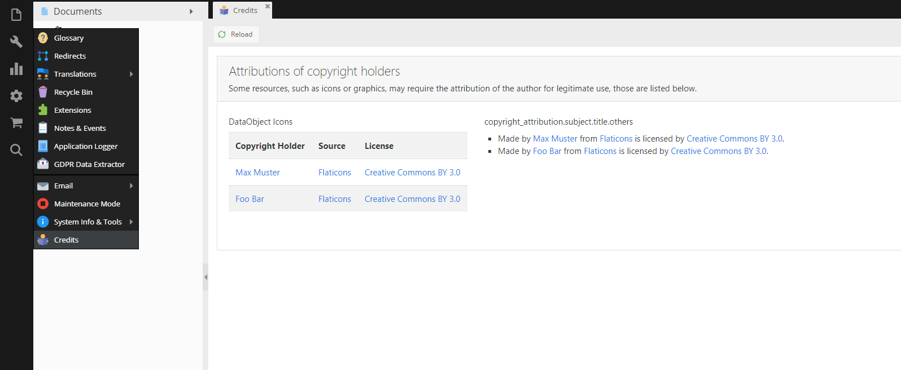

# Pimcore Copyright Attribution Bundle

Adds a simple way to add attribution of authors of external resources like icons, graphics, etc.

## Configuration

```yaml
copyright_attribution:
  subjects:
    dataobject_icons:
      credits:
      - {author: "Max Muster",  author_url: "www.test.at", source: "Flaticons", source_url: "www.flaticons.com", license: "Creative Commons BY 3.0", license_url: "http://creativecommons.org/licenses/by/3.0/"}
      - {author: "Foo Bar",     author_url: "www.test.at", source: "Flaticons", source_url: "www.flaticons.com", license: "Creative Commons BY 3.0", license_url: "http://creativecommons.org/licenses/by/3.0/"}
    others:
      display: list  # 'list' or 'table'
      credits:
      - {author: "Max Muster",  author_url: "www.test.at", source: "Flaticons", source_url: "www.flaticons.com", license: "Creative Commons BY 3.0", license_url: "http://creativecommons.org/licenses/by/3.0/"}
      - {author: "Foo Bar",     author_url: "www.test.at", source: "Flaticons", source_url: "www.flaticons.com", license: "Creative Commons BY 3.0", license_url: "http://creativecommons.org/licenses/by/3.0/"}
```

Translations can be added or edited in `admin` domain.

## Impressions
