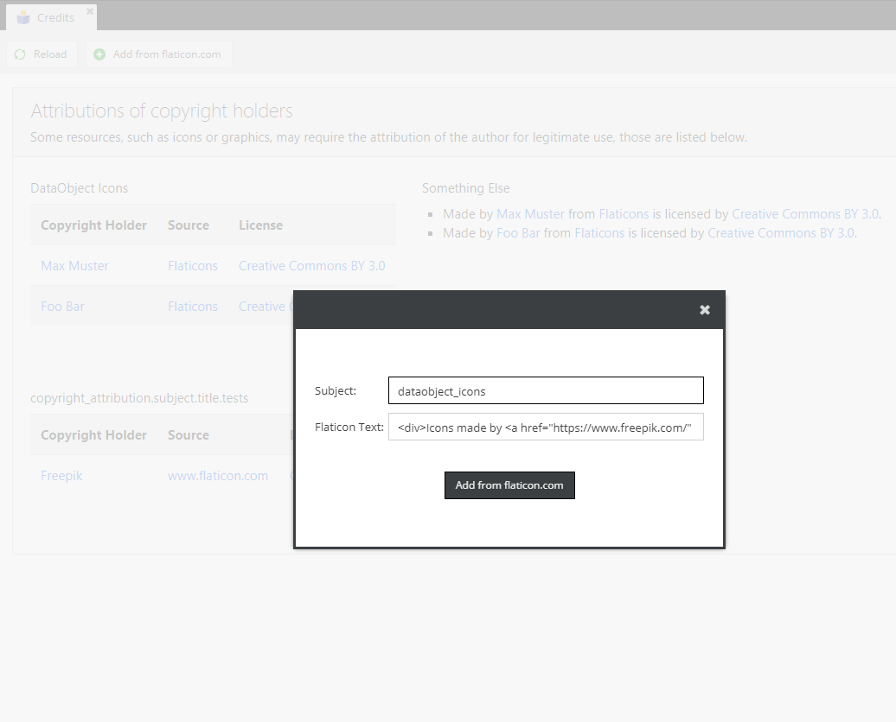

# Pimcore Copyright Attribution Bundle

Adds a simple way to add attribution of authors of external resources like icons, graphics, etc.

## Getting started
### Installation
To install the bundle execute:
```
composer require jremmurd/pimcore-copyright-attribution-bundle
```
### Configuration

Translations can be edited in `admin` domain.

```yaml
copyright_attribution:
  route: "my_custom_route" # override default route
  subjects:
    dataobject_icons:
      credits:
      - {author: "Max Muster",  author_url: "http://www.test.at", source: "Flaticons", source_url: "http://www.flaticons.com", license: "Creative Commons BY 3.0", license_url: "http://creativecommons.org/licenses/by/3.0/"}
      - {author: "Foo Bar",     author_url: "http://www.test.at", source: "Flaticons", source_url: "http://www.flaticons.com", license: "Creative Commons BY 3.0", license_url: "http://creativecommons.org/licenses/by/3.0/"}
    others:
      display: list  # 'list' or 'table'
      credits:
      - {author: "Max Muster",  author_url: "http://www.test.at", source: "Flaticons", source_url: "http://www.flaticons.com", license: "Creative Commons BY 3.0", license_url: "http://creativecommons.org/licenses/by/3.0/"}
      - {author: "Foo Bar",     author_url: "http://www.test.at", source: "Flaticons", source_url: "http://www.flaticons.com", license: "Creative Commons BY 3.0", license_url: "http://creativecommons.org/licenses/by/3.0/"}
```


## Icons from flaticon.com
If you are using free icons from flaticons.com you can simply copy-paste the sample text for web integration which is display on every download attempt.


## Impressions
The copyright attribution can be shown as list or in a table view.
